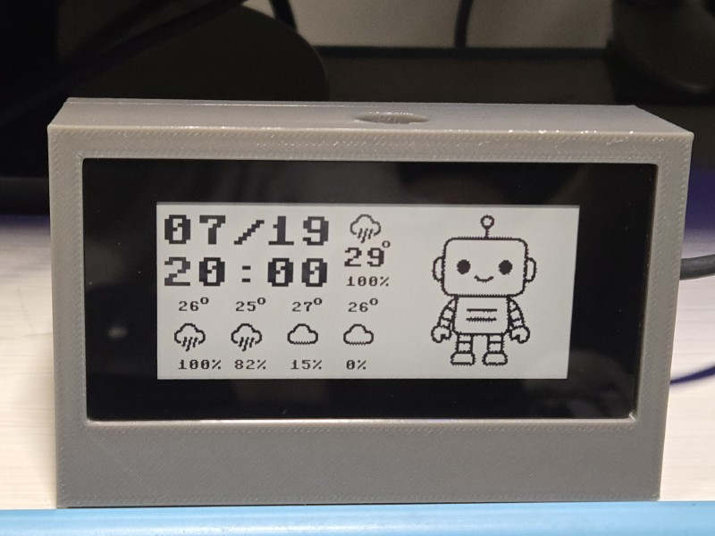
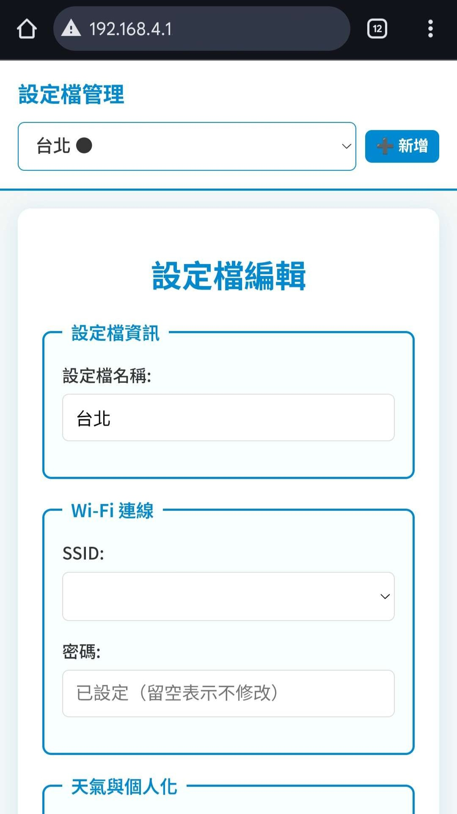

# Pico Clock Weather Display - 基於 Pico W 與 E-Paper 的 IoT 時鐘

本專案是一個基於 Raspberry Pi Pico W 和 Waveshare 2.9 吋電子紙顯示器的 IoT 智慧時鐘。它不僅能顯示時間，還能連接網路獲取天氣資訊、輪播自訂圖片，並具備光線感應與觸控功能。

  

---

## ✨ 主要功能

- **即時天氣顯示**：自動從網路獲取並顯示指定地點的天氣狀況與溫度。
- **時間與日期顯示**：透過 NTP 協定自動同步網路時間，確保時間精準。
- **自訂圖片輪播**：可依設定的時間間隔，輪播 `src/image/custom` 資料夾中的圖片。
- **特殊事件圖片**：在特定日期（如生日或自訂日期）顯示專屬的慶祝圖片，並支援觸控切換。
- **載入頁面圖片隨機顯示**：裝置啟動時，載入頁面的圖片將隨機顯示，增加趣味性。
- **環境光感測**：在光線昏暗時自動關閉螢幕，節省電力並避免夜間光害。
- **觸控與按鈕操作**：透過點擊電子紙螢幕進行互動（如切換圖片）。**長按任一實體按鈕 3 秒可觸發 Wi-Fi 與系統設定重置**，並重新啟動裝置。
- **定時響聲功能**：可設定整點或每半小時透過蜂鳴器發出提示音，音調與音量可調整。
- **AP 模式設定**：當無法連接 Wi-Fi 或透過長按按鈕觸發重置時，系統會自動啟用 AP 模式。
  - **網頁介面**：讓使用者透過手機或電腦連線至裝置 (`http://192.168.4.1`)，設定 Wi-Fi、天氣地點、定時響聲等參數。
  - **動態超時**：網頁設定期間若有操作，會自動延長等待時間，避免中途斷線。
  - **多重重置途徑**：在 AP 模式下，除了透過網頁儲存設定外，也可隨時透過長按實體按鈕來重置裝置。
- **穩定性與錯誤處理**：強化了網路連線、API 請求（包含重試機制）及圖片載入的錯誤處理，確保系統在異常情況下仍能穩定運行。

---

## 🛠️ 硬體需求

1.  **Raspberry Pi Pico W** - 內建 Wi-Fi 的主控制器。
2.  **[Waveshare 2.9inch Touch e-Paper HAT](https://www.waveshare.net/wiki/Pico-CapTouch-ePaper-2.9)** - 296x128 解析度，支援觸控的電子紙模組。
3.  **光敏電阻 (Photoresistor)** - 用於偵測環境亮度，連接至 Pico 的 ADC Pin 26 引腳。
4.  **無源蜂鳴器 (Passive Buzzer)** - 連接至 Pico w 的 Pin 20，用於定時響聲功能。
5.  **電子紙模組內建按鈕** - 專案使用的三顆按鈕是電子紙顯示器模組提供的，分別連接於 Pin 2, Pin 3 和 Pin 15。
6.  **連接線與麵包板** - 或直接焊接在 Pico w 板子上。
7.  **(選用) 3D 列印外殼**：`hardware/` 目錄中提供了 3D 外殼的 `.SLDPRT` 檔案，可自行列印使用。

---

### 🔌 電路接法說明（光敏電阻與蜂鳴器）

以下為光敏電阻與無源蜂鳴器的建議接法：

#### 🌞 光敏電阻（LDR）

透過分壓電路方式讀取光線強度：

```
3.3V ---- 33KΩ 電阻 ----+---- GP26 (ADC 輸入腳位)
                        |
                        |
                    光敏電阻
                        |
                        |
                       GND
```

* 使用 33KΩ 電阻與光敏電阻組成電壓分壓器，將中間節點連接至 Pico 的 GP26 腳位進行 ADC 讀取。
* 光線越強，LDR 阻值越小，輸出電壓越低；反之則輸出越高。

#### 🔔 無源蜂鳴器

```
GP20 (PWM 輸出) ---- 無源蜂鳴器 + 腳  
GND -------------- 無源蜂鳴器 - 腳
```

* 使用 Pico 的 GP20 腳位產生 PWM 訊號，控制無源蜂鳴器發聲。
* 須搭配 `PWM` 函數控制輸出頻率與占空比，以產生不同音調與音量。

---

## 🖼️ 圖片資源說明

本專案的所有圖片資源都存放在 `src/image/` 目錄下，並使用 `.bin` 格式。您可以替換或增加這些圖片來自訂您的時鐘。

- **`image/custom/`**
  - **用途**：存放使用者自訂的輪播圖片。
  - **格式**：建議為 `128x128` 像素的 1-bit 黑白圖片。
  - **說明**：您可以將自己喜歡的圖片（如動漫、風景、迷因等）轉換後放入此處，系統會定時輪播。

- **`image/events/`**
  - **用途**：存放日期特定事件的圖片。除了 `birthday/` 子目錄用於生日圖片外，您還可以創建以 `MMDD` 格式命名的子目錄（例如 `1030` 代表 10 月 30 日），並在其中放入該日期專屬的圖片。系統會自動偵測並顯示這些圖片，並支援觸控切換。
  - **格式**：建議為 `128x128` 像素的 1-bit 黑白圖片。
  - **說明**：您可以為特定節日、紀念日或任何您想標記的日期準備專屬圖片。

- **`image/login/`**
  - **用途**：在裝置啟動、嘗試連接 Wi-Fi 時顯示的過渡畫面。
  - **格式**：建議為 `296x128` 像素的 1-bit 黑白圖片。

- **`image/weather_icons/`**
  - **用途**：顯示天氣狀況的圖示。
  - **格式**：建議為 `32x32` 像素的 1-bit 黑白圖片。
  - **說明**：檔名必須對應 OpenWeatherMap API 回傳的天氣狀況。目前專案內建的圖示檔名如下：
    - `Clear.bin`
    - `Clouds.bin`
    - `Rain.bin`
    - `Drizzle.bin`
    - `Snow.bin`
    - `Thunderstorm.bin`
    - `Tornado.bin`
    - `Squall.bin`
    - `Dust.bin`
    - `Sand.bin`
    - `Mist.bin`, `Fog.bin`
    - `Smoke.bin`, `Haze.bin`


---

## 🚀 軟體安裝與設定

### 0. 環境準備

本專案的開發環境需要 Python 3。請確保您的系統已安裝 Python 3 及 `pip`。

安裝專案所需的 Python 套件：
```bash
pip install -r requirements.txt
```

### 1. 安裝 MicroPython 韌體

- 前往 [MicroPython 官網](https://micropython.org/download/RPI_PICO_W/) 下載最新的 `.uf2` 韌體檔案。
- 按住 Raspberry Pi Pico W 上的 `BOOTSEL` 按鈕，同時將其連接到電腦。
- 電腦會將 Pico 識別為一個名為 `RPI-RP2` 的隨身碟。
- 將下載的 `.uf2` 韌體檔案拖曳至此隨身碟中，Pico 將自動更新並重新啟動。

### 2. 上傳專案檔案

本專案建議使用 `mpremote` 工具進行檔案上傳。

#### 安裝 mpremote
```bash
  pip install mpremote
```

專案內已包含 `upload.py` 腳本，用來自動化將專案檔案部署至 Raspberry Pi Pico W。它提供以下功能與特性：

#### ✅ 上傳檔案範圍

* 自動上傳 `src/` 目錄下的所有 `.py`、`.json` 檔案。
* 同時包含 `src/image/` 目錄中的所有 `.bin` 圖片檔案（可透過 `--no-images` 關閉）。
* 自動建立對應的遠端目錄結構（使用 `mpremote fs mkdir`）。

#### 🧹 清除功能

* 預設會先清除 Pico 上既有的 `.py` 和 `.json` 檔案，若要跳過清除步驟，可加上 `--no-clean` 參數。
* 可選擇使用 `--recursive-clean` 參數，**遞迴清除整個裝置所有檔案與資料夾**。

#### 🔄 上傳流程

1. 執行前先列出並刪除目標檔案（視設定而定）。
2. 建立必要目錄後，上傳所有指定檔案，並顯示進度條與檔案大小。
3. 上傳完成後，自動重啟 Pico 裝置。
4. 最後自動進入互動式 REPL 模式（按 `Ctrl+X` 退出），可用於監控 Pico w 裝置行為。

#### ▶️ 使用方式：

```bash
python upload.py
```

#### 🔧 可用參數：

| 參數                  | 說明                  |
| ------------------- | ------------------- |
| `--no-images`       | 不上傳圖片檔案             |
| `--recursive-clean` | 遞迴清除整個裝置（包含所有目錄與檔案） |
| `--no-clean`        | 跳過清除步驟              |

---


### 3. 進行裝置設定

設定裝置最方便的方式是使用 AP 模式。如果裝置無法連上 Wi-Fi，它會自動進入此模式，或是長按電子紙模組的其中一顆按鈕超過 5 秒，也會重製 Wi-Fi 設定。

#### a) 使用 AP 模式網頁介面 (建議方式)

- 當裝置無法連接到已設定的 Wi-Fi 時，會自動建立一個 Wi-Fi 熱點，SSID 和 Password 會顯示在時鐘上。
- 使用您的手機或電腦連接到此熱點。
- 打開瀏覽器，訪問 `http://192.168.4.1`。
- 在網頁介面中填寫您的 Wi-Fi 資訊、天氣地點、定時響聲等參數。
- 網頁會即時顯示光感應器數值，並每 3 秒自動更新。
- 提交後，裝置將儲存設定並自動重啟，嘗試連接新的 Wi-Fi。

 

#### b) 手動設定 (進階)

您也可以在電腦上預先建立設定檔再上傳。此方式適合需要自訂 AP 模式 SSID 或天氣 API 金鑰的開發者。

1.  將 `src/config.json.example` 複製一份並改名為 `src/config.json`。
2.  打開 `src/config.json` 並依據您的需求填寫。請參考下方「可調設定參數」章節。
3.  執行 `python upload.py`，腳本會將 `src` 目錄下的所有檔案（包含您的 `config.json`）上傳到裝置。

---

## 📊 可調設定參數

所有設定參數儲存在 `config.json` 中，並可透過 AP 模式網頁介面進行調整。支援巢狀結構，如 `chime.enabled`、`weather.location`。

| 參數名稱                  | 說明                     | 類型   | 範例值        |
|---------------------------|--------------------------|--------|----------------|
| `ap_mode_ssid`            | AP 模式 SSID              | 字串   | `"Pi_Clock_AP"`   |
| `ap_mode_password`        | AP 模式密碼               | 字串   | `"123456"`     |
| `wifi_ssid`               | Wi-Fi SSID               | 字串   | `"MyHomeWiFi"` |
| `wifi_password`           | Wi-Fi 密碼                | 字串   | `"password"`  |
| `api_key`                 | openweathermap API key   | 字串   | `""`           |
| `location`                | 天氣地點                  | 字串   | `"Taipei"`     |
| `birthday`                | 生日日期（MMDD）          | 字串   | `"0101"`       |
| `user.timezone_offset`    | UTC 時間偏移量（小時）     | 數字   | `8`            |
| `user.light_threshold`    | ADC 光感臨界值            | 整數   | `56000`        |
| `user.image_interval_min` | 圖片換圖間隔（分鐘）       | 整數   | `2`            |
| `chime.enabled`           | 啟用定時響聲              | 布林值 | `true`         |
| `chime.interval`          | 響聲間隔（整點／半小時）   | 字串   | `"hourly"`     |
| `chime.pitch`             | 音調（頻率，300 ~ 3k Hz） | 整數   | `80`           |
| `chime.volume`            | 音量（0~100）             | 整數   | `80`           |

---

## 🕹️ 使用說明

- **正常運作**：成功連上 Wi-Fi 後，裝置會自動顯示時間、天氣和輪播圖片。
- **觸控互動**：輕觸螢幕可以觸發預設的動作（例如：手動更換圖片）。
- **低光模式**：當環境光線高於 `light_threshold` 設定值時，螢幕會自動進入休眠狀態。
- **設定重置**：無論在任何模式下，長按任一實體按鈕 3 秒，即可清除 Wi-Fi 與 AP 設定並重啟裝置，直接進入 AP 模式，方便重新設定。

---

### 圖片轉換

* 本專案輪播的自訂圖片需要是 **1-bit 黑白** 的 `.bin` 格式檔案。
* **重要提示**：為了達到最好的顯示效果，建議您先將圖片進行 **去背處理**，並儲存為 **透明背景的 `.png` 檔案**。然後，使用 `tools/image_to_bin.py` 工具將其轉換為對應尺寸的灰階 `.bin` 檔案，並放置到正確的圖片資料夾中。
* **轉換步驟**：

  1. 在您的電腦上執行 `python tools/image_to_bin.py`，這是一個圖形化介面的轉換工具。
  2. 點擊「選取圖片」並載入您處理好的 `.jpg` 或 `.png` 圖檔。
  3. 根據圖片用途，設定對應的「輸出寬度」和「輸出高度」：
     * `image/weather_icons/`：`32x32` 像素
     * `image/login/`：`296x128` 像素
     * 其餘圖片（如 `image/custom/`, `image/events/`）：`128x128` 像素
  4. 點擊「更新預覽」查看轉換效果。
  5. 點擊「儲存 .bin 檔案」將結果儲存。
* 將轉換後的 `.bin` 檔案放入 `src/image/` 下對應的資料夾（例如 `src/image/custom` 或 `src/image/events/MMDD`），並再次執行 `upload.py` 上傳即可。

#### 圖片處理說明（轉換原理）

* 圖片載入後會先被縮放至指定尺寸，確保顯示正確。
* 接著，圖片會自動轉為灰階，並使用 **Floyd–Steinberg 誤差擴散演算法（dithering）** 將灰階圖轉為 **1-bit 黑白圖**。
* 此演算法會將像素的灰階誤差擴散至周圍像素，以黑白點的排列方式模擬出灰階效果，即使是只有黑與白的 ePaper 裝置，也能呈現出較為平滑的漸層與細節。
* 最終圖片會轉換為符合 `framebuf.MONO_HLSB` 格式的 `.bin` 檔案，內容為純像素資料（不含檔頭），可直接載入至顯示緩衝區。

---

### 專案結構

- `src/`: 主程式碼目錄。

#### 程式碼功能分解

- `src/main.py`: 程式進入點，負責初始化與協調各模組。
- `src/app_controller.py`: 應用程式主邏輯控制器，處理應用程式的核心邏輯，如觸控、按鈕事件、顯示更新等。
- `src/app_state.py`: 管理應用程式的各種狀態，例如最後更新時間、圖片偏移量、天氣資料等。
- `src/chime.py`: 定時響聲功能模組，控制蜂鳴器發出提示音。
- `src/config_manager.py`: 設定檔讀寫管理，提供統一的設定存取介面，處理 `config.json` 的載入與儲存。
- `src/display_manager.py`: 顯示邏輯管理，負責畫面繪製與更新，根據應用程式狀態選擇顯示不同的頁面（天氣、時間、生日等）。
- `src/display_utils.py`: 顯示相關的工具函數，包含圖片旋轉、文字縮放、圖片繪製等底層顯示操作。
- `src/epaper.py`: 電子紙驅動程式 (請勿修改)，提供與電子紙螢幕硬體互動的介面。
- `src/file_manager.py`: 檔案操作相關工具，用於列出檔案、隨機排序檔案、獲取圖片路徑等。
- `src/hardware_manager.py`: 硬體相關操作，負責讀取 ADC 值（光線感測器）、按鈕狀態和觸控事件。
- `src/netutils.py`: 網路工具函數，包含 Wi-Fi 連線、NTP 時間同步、載入/儲存 Wi-Fi 配置等。
- `src/weather.py`: 天氣資料獲取與處理，從 OpenWeatherMap API 獲取當前天氣和天氣預報。
- `src/wifi_manager.py`: Wi-Fi 連線與 AP 模式管理，包含 Web 設定介面，用於使用者配置 Wi-Fi 和其他參數。
- `src/image/`: 存放所有 `.bin` 圖片資源。
- `tools/image_to_bin.py`: 圖片轉換工具。
- `hardware/`: 硬體相關的 CAD 檔案。
- `upload.py`: 用於部署檔案至 Pico 的腳本。

---

## 📚 參考資料與授權資訊

本專案部分程式碼與資源來自第三方開源專案，以下列出引用來源與其授權方式，並已依據相關條款合法使用與標示：

### 1. Waveshare 官方範例程式碼

- **來源**：  
  [waveshareteam/Pico_CapTouch_ePaper](https://github.com/waveshareteam/Pico_CapTouch_ePaper/blob/main/python/Pico_CapTouch_ePaper_Test_2in9.py)

- **用途**：  
  部分驅動程式碼參考自上述範例，用於控制 2.9 吋電子紙顯示器與觸控模組，並根據實際需求進行重構與調整。

- **授權方式**：  
  該檔案內含 MIT License 授權聲明，允許自由使用、修改與再散佈。已於本專案中保留原始授權區塊並遵循授權條款。


### 2. 天氣圖示資源（weather-icons）

- **來源**：  
  [erikflowers/weather-icons](https://github.com/erikflowers/weather-icons)

- **用途**：  
  `src/image/weather_icons/` 資料夾中的 `.bin` 圖示為基於該專案的 `.svg` 圖示修改與重新繪製後，先匯出為 `.png`，再透過本專案自製工具轉換為 1-bit `.bin` 格式，以配合電子紙顯示需求使用。

- **授權方式**：  
  原始圖示遵循 [SIL Open Font License 1.1 (OFL-1.1)](http://scripts.sil.org/OFL) 授權。根據授權條款，這些修改後的圖示仍依相同條款公開，並未用於任何商業行為或單獨銷售。

---

## 📄 本專案授權條款

本專案之程式碼與資源（不含上述第三方資源）採用：

### 📘 Creative Commons Attribution-NonCommercial 4.0 International (CC BY-NC 4.0)

您可以：

- ✅ 自由使用、學習、修改本專案內容
- ✅ 分享或轉載（需保留原作者資訊與授權聲明）
- ❌ 禁止任何形式的商業用途（如販售、商業課程、廣告嵌入、產品整合等）

若有商業用途需求，請聯繫原作者取得授權。
詳細授權條款請參見：[https://creativecommons.org/licenses/by-nc/4.0/deed.zh_TW](https://creativecommons.org/licenses/by-nc/4.0/deed.zh_TW)

---